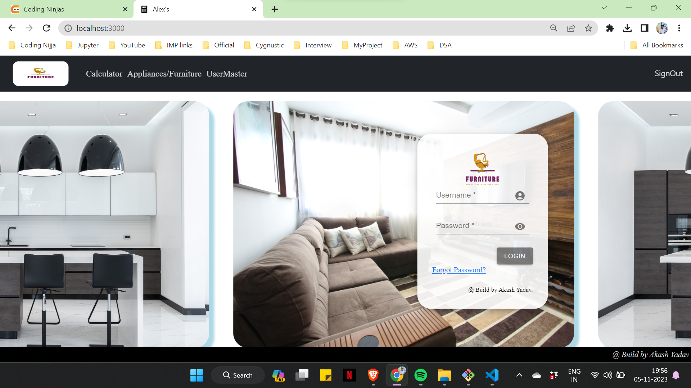
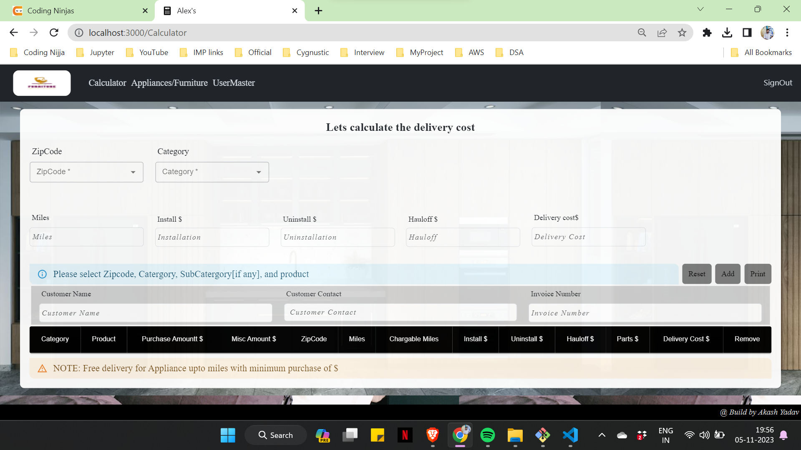
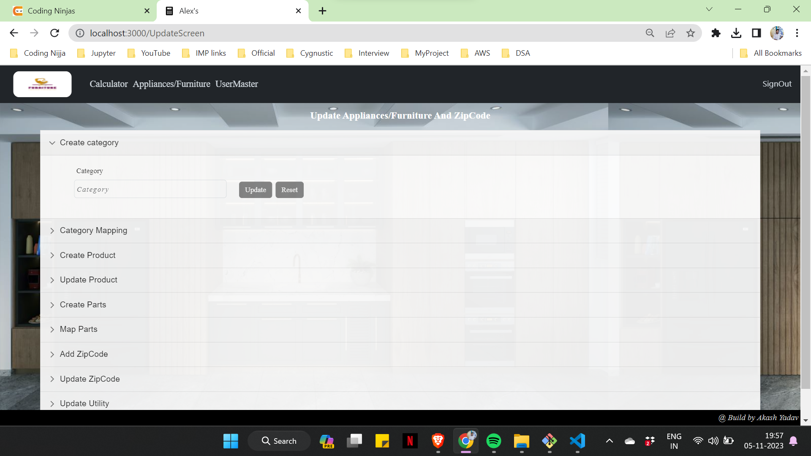

# Inventory Calculator

## Overview

The Inventory Calculator is a web application developed using React, Material UI, Redux, React Router, and Styled-Components. It is designed for adding and managing products in a store, calculating delivery costs, installation, uninstallation, and haul-off costs.

## Features
- Product Management: Easily add, edit, or remove products in the store's inventory.
- Cost Calculation: Calculate the delivery, installation, uninstallation, and haul-off costs for each product.
- User-Friendly Interface: Built with Material UI for a clean and responsive design.
- State Management: Utilizes Redux for efficient state management.
- Navigation: Implemented with React Router for seamless page transitions.

## Tech Stack
- React
- Material UI
- Redux
- React Router
- Styled-Components

# Getting Started
Follow these steps to set up and run the project locally:

1. Clone the Repository:
    git clone https://github.com/yourusername/inventory-calculator.git

2. Install Dependencies:
    cd inventory-calculator
    npm install

3. Start the Development Server:
    npm start

4. The application should now be running locally at http://localhost:3000.

# ScreenShoot

1. Login Screen

2. Calculator Screen

3. Update inventory Screen

